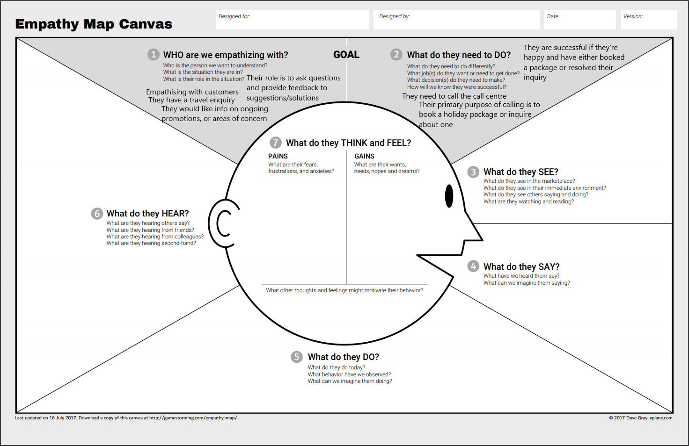

# ISDM Report
## Empathy Map

## POV Statements
`[User . . . (descriptive)] needs [Need . . . (verb)] because [Insight . . . (compelling)]`

Travel company who wants this new information system needs it to be reliable because downtime is costly in terms of money and customers

Customer who has a difficult problem needs a suitable and skilled RM because their problem may be complex

Customer who has a simple problem needs any available RM because their problem is very simple and easy to solve

RM who is busy and is in a call with another customer needs not to be disturbed by another call because they’re unavailable
