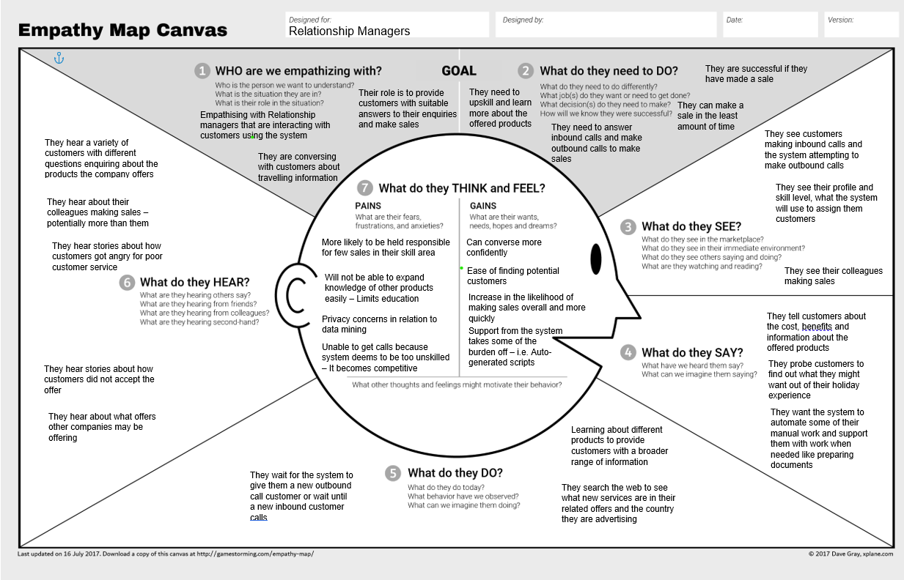
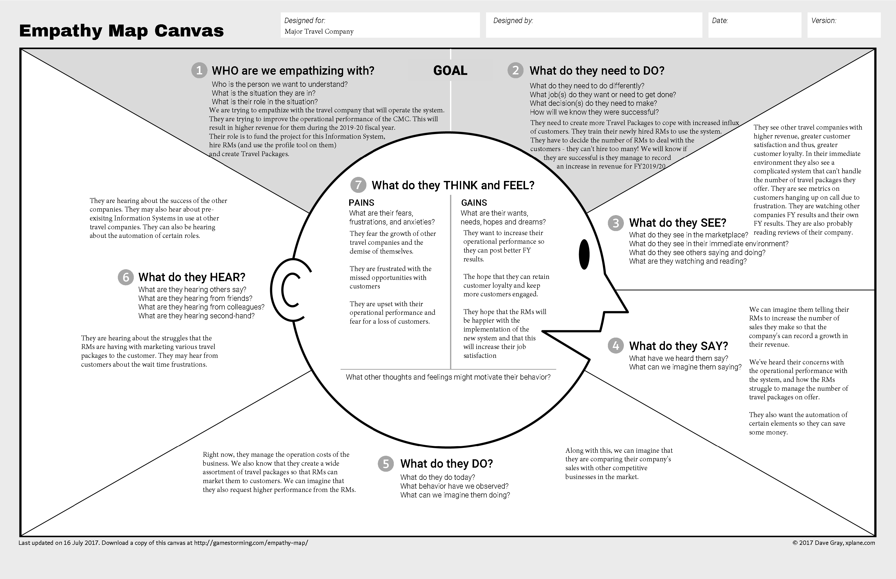
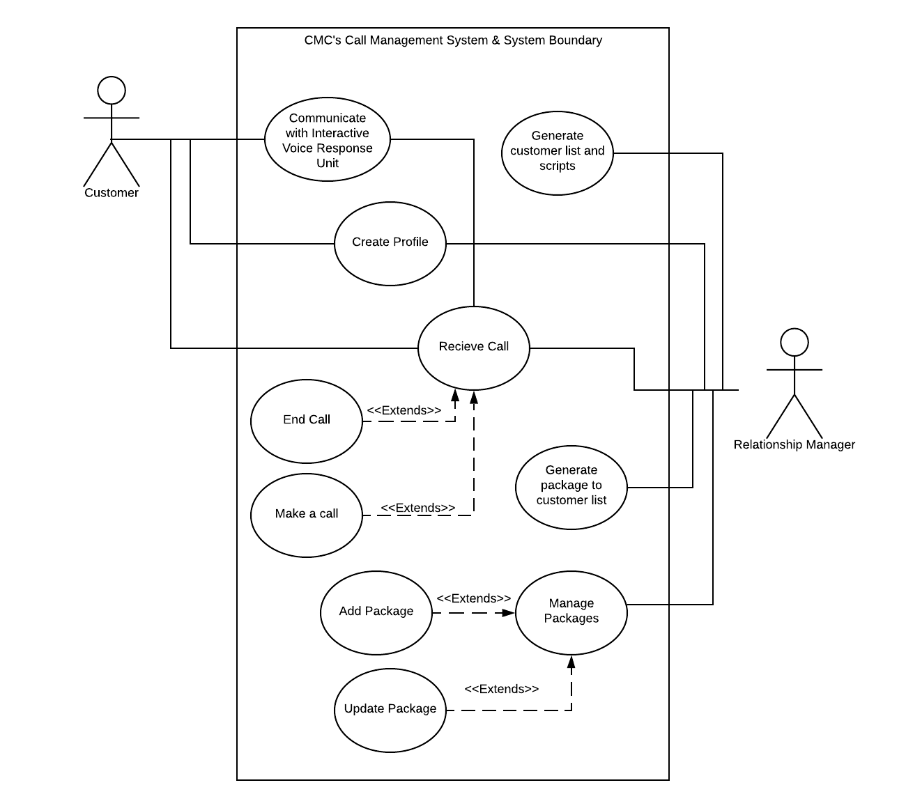
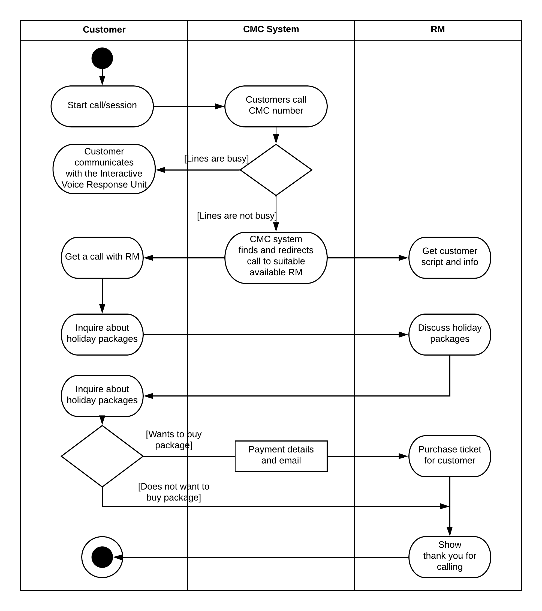
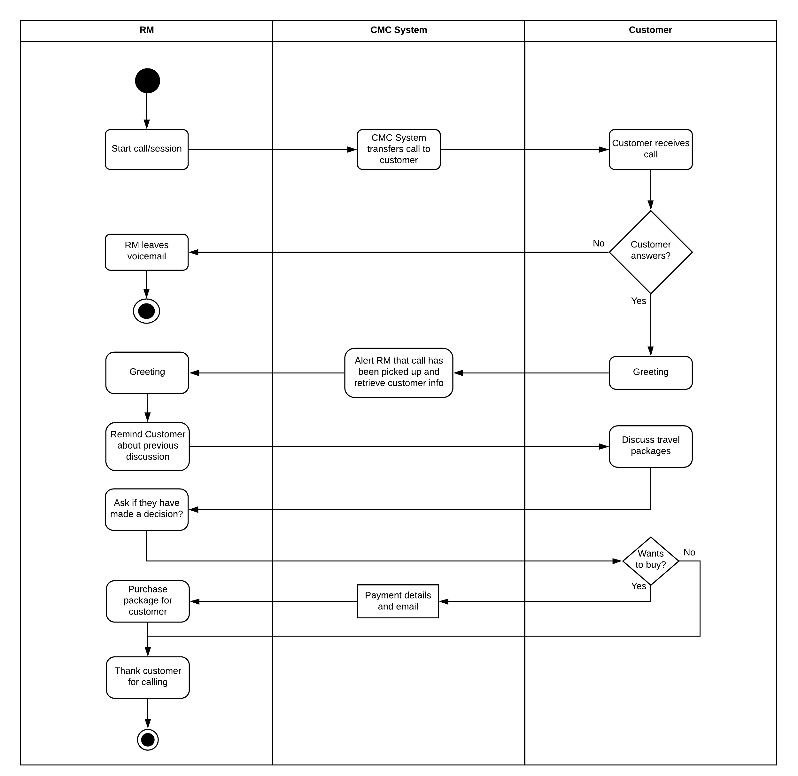
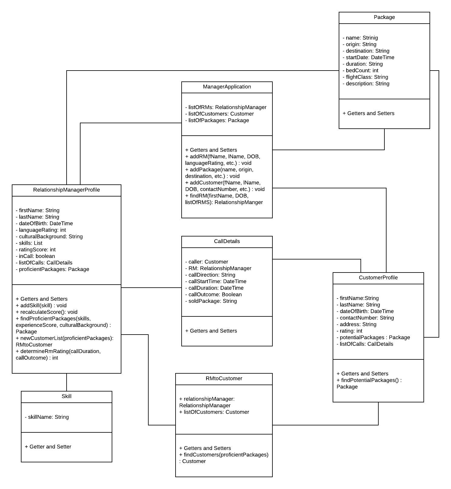

# Important Links
Lucid Chart: https://app.lucidchart.com/invitations/accept/d5ad01ec-910a-4e48-a299-46795ca0b8a1

# Executive Summary
<-- Execute summary goes here --->

# Project Approach
<-- Discuss use of design thinking + agile scrum -->

# Definition

## Project Objectives & Problem
The aim of this project is to deliver an end-to-end design for a Automated Call Routing System (ACRS) to the organisations call management center (CMC). This system will maximise efficiency by adjusting customer calls to relationship managers (RMs) with the domain knowledge of the potential / existing customer's profile. This will ensure that customers are matched with the most appropriate and well informed RM). The proposed system aims to improve the operational performance of the CMC by prioritising customer calls, performing customer-RM matching, and improving the outcomes of outbound telemarketing calls. In doing so, the system is projected to lift the organisations revenues in the 2019-20 fiscal year.

# Stakeholders
There are several stakeholders in this project: 

Customer
 * They use the call center when dialing in.

 * We chose customer as a stakeholder as they are users of the system. As a result of this, they present an interest in the development of the system.

Relationship Manager (RM)
 * RMs are matched to customers, through the system, and present travel packages to them.

 * We chose RMs as a stakeholder as they are use the system to interact with customers. They are affected by the development of the system.

Major Travel Company
 * They will operate this system.

 * We chose Major Travel Company as a stakeholder as they are funding this project and will operate the system.

# Design Thinking Processes
## Empathy Maps
### Customer

Note that there were assumptions made about the behaviour of the customer in the above empathy map
### Relationship Manager

### Travel Company

## POV Statements
> Point of View (POV) statements aim to record the various perspective's of the identified stakeholders. They are sythentised based on the information discovered in the 'Empathise' stage of the design thinking process.

Travel Company:
 * Travel company who needs this new system to be reliable as downtime is costly in terms of money and customers.

 * Travel company who sees a new intelligent call routing and management system as an instrument to improve the operational performance of their CMC   and increase their revenue for the 2019-20 fiscal year.

 * Travel company who will utilise this new information system who require a Profiler Tool to be integrated with the call management system to match customers with RMs. 

 * Travel company who makes multiple travel packages need the new information system to handle and make accessible the high volume of package offers to allow for easier presentation by RMs to customers.

Callers (Company Customers):
 * Customer who has a difficult problem needs a suitable and skilled RM because their problem may be complex

 * Customer who has a simple problem needs any available RM because their problem is very simple and easy to solve

Relationship Manager (RM):
* RM should not be routed new calls when an existing call is taking place

* RM who is waiting for inbound calls needs a list of outbound customers to call because they need to make sales during work hours

* RM who is in call with a customer needs information regarding the company's products tailored to both the RM and caller

* RM who should only be routed customers who they are able to support based on their skills and experience

System Design Team: 
 * We have been contracted by a major travel company to improve the operational performance of their CMC. We noticed that the travel company isn't recording a growth in revenue during the 2019-20 fiscal year. We wonder if this means that the performance of the CMC impacts the fiscal year results. It would be game changing to improve the operational performance of the CMC using an information system.

 * We've heard from many RMs that they struggle to manage the various travel packages on offer. We were surprised to notice the number of travel packages produced by the travel company. We wonder if this means that customers are offered unnecessary packages by the RMs. It would be game changing to have RMs updated with new travel packages, that only apply to their customers, as soon as they are created.

 * We've met we many customers who that they hang up the call due to difficulties. We were surprised to noticed that the wait times for the call can be quite long. We wonder if this means that many potential buyers are missed in the queue. It would be game-changing to reduce the number of customers lost in the queue.

## Assumptions
Several assumptions have been made in this project:
* There are improvements *needed* to be made to the call management center 

* There is an inherent *need* for the customer to utilise the call center services (i.e. they want to book holidays, make complaints)

* All stakeholders wholeheartedly agree to the project objectives and solution
* There are existing or new relationship managers

* The social and economic environment of stakeholders (e.g. customer's economic background)

* Information of packages and delivery of new packages are handled by the system and is in scopes

* Relationship managers are to handle the updating and addition of packages onto the system

# Ideation
>The goal is of ideation is to brainstorm possible questions and solutions. It represents a process of 'going wide' in terms of concepts and outcomes.

## How Might We Statements
> 'How Might We' statements aim to capture the goals of the design team as alinged to the POV of the various stakeholders.

1. How might we build a reliable system that is able to handle a large amount of calls

2. How might we reduce the wait time of customers with the most potential to purchase

3. How might we profile an RM so that we can recrod their area of expertise

4. How might we measure the performance of an RM

5. How might we handle large volumes of inbound customers

6. How might we help to reduce inbound call costs

7. How might we help RMs better understand their customers

# Prototyping and Models
## Use Case Diagram

## Activity Diagram
### Inbound Call

### Outbound Call

## Class Diagram

## Collaborative Diagram

# Competitive Advantages and Repercussions
> Competitive advantage refers to circumstances that provide a particular company a favourable business position. This can come from lower costs, and/or differentiation from competitors.

For the CMC, being able to noticeably improve customer service with their new systematically provides great benefit in regards to the company's revenue as well as reputation, yielding a long-lasting competitive advantage. 

Firstly, the ability to match a customer to a RM according to character profiles (Profiler Tool) allows the company to cater to the individual's preference and desired selection of holiday packages with a well-versed specialist in that field. This means that customers will be provided information that is likely up-to-date and well-informed from appropriately-skilled RMs - therefore making the customer service effective and persuasive in contrast to other competitor services.

Next, the travel company is able to improving revenue stream by streamlining their customer service to customers that have shown interest in the provided holiday packages previously; this is by serving return customers that have higher scores of purchase likelihood. Prioritising customers likely to purchase packages allows the company to provide greater customer service when it is most needed - therefore bolstering sales.

However, in the unlikely event that the project fails, ...
