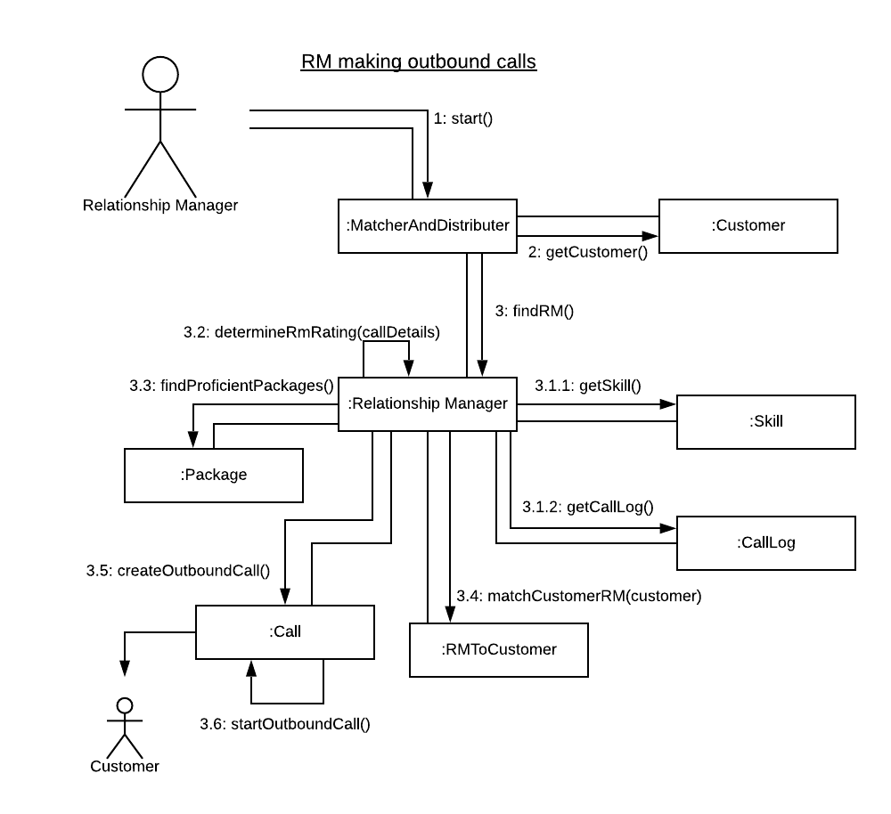

# Information System Development Methodologies Assignment (31257)
### Authors
* Dennis Zub (13571649)
* Hasith Jayasakera (13562133)
* James Lee (13583950)
* Kevin Leung (13584228)

# Executive Summary
This report provides a business analysis and design-thinking process of implementing a new Automated Call Routing System (ACRS) into an existing call center management center (CMC). Methods of analysis involve understanding stakeholders, constructing models to illustrate underlying processes, and investigating the potential advantages and/or consequences of project success or failure. The design thinking process is outlined below and documented with the online GitHub service. This report finds that a successful implementation of this project can lead to substantial positive benefits to stakeholders such as the customer, the relationship manager and the travel company. This may include but is not limited to: 
* Increased company revenue and customer-base
* Improved public image from improved customer service
* Competitive advantage (differentiation and cost savings)

# Project Approach

## Design Thinking
Using the design thinking process allows us, the designers/developers of the system, to precisely define the scope, and solve, a problem. This is done through the various stages of design thinking.

### Empathy
For the empathy stage, we decided to use empathy maps to truly understand the perspectives of the stakeholders. It is important to note that these empathy maps describe their experiences before the implementation of the new system.  

### Define
By analysing the empathy maps created in the previous stage, we can properly define the scope of the problem that the current environment presents. We achieved this through the use of Point of View (POV) statments. While we created POV statements for all the stakeholders, we also created them for ourselves. This was in order to uncover more potential problems with the current system from our perspectives. Overall, the define stage allowed us to understand our stakeholders and their needs.

### Ideate
After the defining stage, we created How Might We (HWM) statements to isolate the functions that we hope our new system will be able to achieve. To do this, we reference the POV of the stakeholders.

### Prototype
The prototype phase allows us to address each of the problems defined in the previous steps. We created Use Case Diagrams, Activity Diagrams, Class Diagrams and Collaborative Diagrams to define the core functionality of our proposed system prototype.

### Test
It is important, that once the system is developed, that we assess it against the requirements set by the stakeholders. This stage of the design thinking methodology allows us to iterate over many designs to ensure that the best solution is presented to the clients.

## Agile

The agile development methodology allows us to deliver the proposed solution is smaller increments quickly. It allows to rapidly adapt to evolving and emerging business needs and concerns.

### Roles
In the agile development methodology, there are 3 roles: Product Owner, Scrum Master and the Development Team. With our current project, all of us are a part of the development team, while Dennis, the admin of GitHub repository, is the Scrum Master. The product owner is the chief executive officer of the major travel company.

### Events
#### Sprint Planning
Sprint planning involves all three roles in the agile development methodology. The aim of sprint planning is to centralise a goal for the sprint and manage/plan how the deliverables will be released. This was initially completed in Week 2 with the creation/prioritisation of the backlog.

#### Sprint Review
This process involves reviewing the completed deliverables of the sprint. The observations made in this event are essential for the next event: Sprint Retrospective.

#### Sprint Retrospective
The sprint retrospective allows the Scrum Team to looking back on the overall sprint process and isolate key areas for improvement. These areas can be dealt with in future sprints.

#### Daily Scrum
As the Agile methodology involves ever-changing requirements and needs, plans for the sprint also change. That is why Daily Scrum is required for all members of the development team to attend. This allows each member to understand the collective work being done, so that the deliverables are still on track for release during the same sprint.

### Artefacts
#### Product Backlog
The aim of the product backlog is to order all the requirements that are required in the final product. It comprises of product backlog items, that the Product Owner is responsible for, which link to our GitHub issues that we have created.

#### Sprint Backlog
Like the product backlog, it contains product backlog items, but not all of them. It only includes items that are set to be completed during the current sprint and a delivery plan of this sprint. As our project only contains one sprint, all our items in the product backlog are within our sprint backlog. These can be visualised through the use of Kanban boards so that the Development Team, which manages, creates and owns the sprint backlog, can track the progress of work.

# Definition

## Project Objectives & Problem
The aim of this project is to deliver an end-to-end design for a Automated Call Routing System to the organisations call management center. This system will maximise efficiency by adjusting customer calls to relationship managers (RMs) with the domain knowledge of the potential / existing customer's profile. This will ensure that customers are matched with the most appropriate and well informed RM). The proposed system aims to improve the operational performance of the CMC by prioritising customer calls, performing customer-RM matching, and improving the outcomes of outbound telemarketing calls. In doing so, the system is projected to lift the organisations revenues in the 2019-20 fiscal year.

# Stakeholders
There are several stakeholders in this project: 

Customer
 * They use the call center when dialing in.

 * We chose customer as a stakeholder as they are users of the system. As a result of this, they present an interest in the development of the system.

Relationship Manager (RM)
 * RMs are matched to customers, through the system, and present travel packages to them.

 * We chose RMs as a stakeholder as they are use the system to interact with customers. They are affected by the development of the system.

Major Travel Company
 * They will operate this system.

 * We chose Major Travel Company as a stakeholder as they are funding this project and will operate the system.

# Design Thinking Processes
## Empathy Maps
### Customer

Note that there were assumptions made about the behaviour of the customer in the above empathy map
### Relationship Manager

### Travel Company

## POV Statements
> Point of View (POV) statements aim to record the various perspective's of the identified stakeholders. They are sythentised based on the information discovered in the 'Empathise' stage of the design thinking process.

Travel Company:
 * Travel company who needs this new system to be reliable as downtime is costly in terms of money and customers.

 * Travel company who sees a new intelligent call routing and management system as an instrument to improve the operational performance of their CMC   and increase their revenue for the 2019-20 fiscal year.

 * Travel company who will utilise this new information system who require a Profiler Tool to be integrated with the call management system to match customers with RMs. 

 * Travel company who makes multiple travel packages need the new information system to handle and make accessible the high volume of package offers to allow for easier presentation by RMs to customers.

Callers (Company Customers):
 * Customer who has a difficult problem needs a suitable and skilled RM because their problem may be complex

 * Customer who has a simple problem needs any available RM because their problem is very simple and easy to solve

Relationship Manager (RM):
* RM should not be routed new calls when an existing call is taking place

* RM who is waiting for inbound calls needs a list of outbound customers to call because they need to make sales during work hours

* RM who is in call with a customer needs information regarding the company's products tailored to both the RM and caller

* RM who should only be routed customers who they are able to support based on their skills and experience

System Design Team: 
 * We have been contracted by a major travel company to improve the operational performance of their CMC. We noticed that the travel company isn't recording a growth in revenue during the 2019-20 fiscal year. We wonder if this means that the performance of the CMC impacts the fiscal year results. It would be game changing to improve the operational performance of the CMC using an information system.

 * We've heard from many RMs that they struggle to manage the various travel packages on offer. We were surprised to notice the number of travel packages produced by the travel company. We wonder if this means that customers are offered unnecessary packages by the RMs. It would be game changing to have RMs updated with new travel packages, that only apply to their customers, as soon as they are created.

 * We've met we many customers who that they hang up the call due to difficulties. We were surprised to noticed that the wait times for the call can be quite long. We wonder if this means that many potential buyers are missed in the queue. It would be game-changing to reduce the number of customers lost in the queue.

## Assumptions
Several assumptions have been made in this project:
* There are improvements *needed* to be made to the call management center 

* There is an inherent *need* for the customer to utilise the call center services (i.e. they want to book holidays, make complaints)

* All stakeholders wholeheartedly agree to the project objectives and solution
* There are existing or new relationship managers

* The social and economic environment of stakeholders (e.g. customer's economic background)

* Information of packages and delivery of new packages are handled by the system and is in scopes

* Relationship managers are to handle the updating and addition of packages onto the system

* The profiles created by the Profiler Tool seamlessly integrates with the system

# Ideation
>The goal is of ideation is to brainstorm possible questions and solutions. It represents a process of 'going wide' in terms of concepts and outcomes.

## How Might We Statements
> 'How Might We' statements aim to capture the goals of the design team as alinged to the POV of the various stakeholders.

1. How might we build a reliable system that is able to handle a large amount of calls

2. How might we reduce the wait time of customers with the most potential to purchase

3. How might we profile an RM so that we can recrod their area of expertise

4. How might we measure the performance of an RM

5. How might we handle large volumes of inbound customers

6. How might we help to reduce inbound call costs

7. How might we help RMs better understand their customers

# Prototyping and Models
## Use Case Diagram

## Activity Diagram
### Inbound Call

### Outbound Call

## Class Diagram

The core functionality of the proposed system is driven by the 'Matcher and Distributor' class. It is envisioned that it is to be used as the central class / object that powers the operation of a system. This is achieved by enumatring the propeties of the object with lists of relationship managers, customers, and packages. In bound calls into the CMC are then instantiated into objects, analysed by the matcher, and distributed to the appropriate RM based on the parameters (i.e. RM skill, customer rating etc). 

## Collaborative Diagram

# Competitive Advantages and Repercussions
> Competitive advantage refers to circumstances that provide a particular company a favourable business position. This can come from lower costs, and/or differentiation from competitors.

For the CMC, being able to noticeably improve customer service with their new systematically provides great benefit in regards to the company's revenue as well as reputation, yielding a long-lasting competitive advantage. This innovative solution differentiates their product and services from competitors whilst at the same time lowering time inefficiencies with more successful matching capabilities. Catering to a returning customer revenue stream with the scoring system allows CMC to maintain a reliable business position.

Firstly, the ability to match a customer to a RM according to character profiles (Profiler Tool) allows the company to cater to the individual's preference and desired selection of holiday packages with a well-versed specialist in that field. This means that customers will be provided information that is likely up-to-date and well-informed from appropriately-skilled RMs - therefore making the customer service effective and persuasive in contrast to other competitor services.

Next, the travel company is able to improving revenue stream by streamlining their customer service to customers that have shown interest in the provided holiday packages previously; this is by serving return customers that have higher scores of purchase likelihood. Prioritising customers likely to purchase packages allows the company to provide greater customer service when it is most needed - therefore bolstering sales.

Moreover, improving operations for outbound involving the addition of matching customers and RMs with prepared guidelines and scripts significantly raises the chances of successfully gaining a paying customer. Regardless of whether the customer accepts a holiday package deal from the initial outbound, this process is effective in providing a first-stop platform for customers later interested in travel - consolidating the CMC as a strong competitor to other travel services.

However, as with all projects, there is always a slim possibility of project failure. It is important to define what a project 'failure' is:
> A project is considered a failure if it has not delivered on its requirements/expectations. This occurs if the deliverables are late or do not deliver the intended business value

As such, in this case study, failure can be in the form of any of the resultant effects below:

* The call distribution system has not been delivered and/or is not performing as intended or to a standard that is operational.

* Customers don't like the customer service from the customers the matching system has provided (poor profiling)

* Lower customer inquiries (inbound calls) and subsequently lower average sales

* The customers spend too much time waiting and average hang-ups increase

* RMs find that the script does not resonate with the customer (poor profiling)

If failure occurs, the travel company is in danger of losing market share and any competitive advantage a successful project might've given. This project could be quite costly both in terms of time and money. There is no significant impact on the RM stakeholders nor the customer - however there is a chance that this failed project could lead to a loss in public image and trust of the travel company - resulting in a long-term damaging effect on sales.

# Project Board

